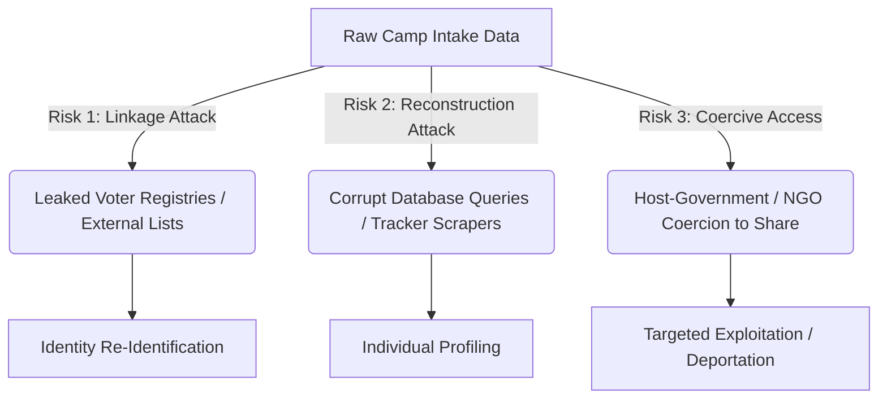

# Data Protection & Do-No-Harm Assessment
## Project: AegisAid — Privacy-Safe Humanitarian Resource AI

### Executive Summary
Humanitarian organizations operate under the core ethical imperative to **"Do No Harm."** In digital resource allocation systems, however, the very data collected to direct aid (food insecurity, medical conditions, household demographic structures) can become a liability. If exposed, this data can be utilized by hostile actors for targeting, harassment, deportation, or exploitation. 

This document evaluates the threat landscape for AegisAid and outlines the mathematical and structural safety guarantees implemented to protect the estimated 120,000 displaced individuals.

---

### Part 1: Threat Model & Risk Analysis

The AegisAid threat model considers three key risk vectors:



#### Risk Vector 1: Linkage Attacks (Identity Disclosure)
*   **Threat Description**: Attackers intercept anonymized aid datasets and cross-reference them with external registries (e.g. leaked local voters list, telecom metadata, or social media records) containing common attributes (quasi-identifiers) like age, gender, and camp location.
*   **Harm Potential**: Hostile local actors could isolate unique combinations (e.g. "Only one household in Camp Beta is female-headed, age group 65+, with a family size of 9") to locate and target specific individuals for extortion or violence.

#### Risk Vector 2: Database Reconstruction Attacks (Attribute Disclosure)
*   **Threat Description**: External observers query aggregate statistical API outputs repeatedly to reconstruct the underlying raw microdata (e.g., querying "Total diabetes cases in Camp Alpha" before and after a specific household registers).
*   **Harm Potential**: Hostile actors trace the medical needs of specific individuals, exposing chronic illnesses, which could lead to discrimination or denial of access to surrounding areas.

#### Risk Vector 3: Coercive Administrative Data Demands
*   **Threat Description**: Host-country governments or coalition partners pressure camp operators or local NGOs to hand over active databases for security sweeps or demographic tracking.
*   **Harm Potential**: The dataset becomes a tool for targeted deportation or political policing.

---

### Part 2: AegisAid Mitigation Blueprint & Technical Guarantees

To ensure AegisAid is *structurally incapable* of exposing individual identities, we integrate three layers of defense directly into the technical architecture.

```
+------------------------------------------------------------+
|             Layer 3: Local Offline Sandbox                 |
|   (Client-side execution, zero central database dependency) |
+------------------------------------------------------------+
                             ||
                             \/
+------------------------------------------------------------+
|             Layer 2: Local Differential Privacy            |
|   (Laplace Noise injection: Reported = Actual + Noise)     |
+------------------------------------------------------------+
                             ||
                             \/
+------------------------------------------------------------+
|                  Layer 1: k-Anonymity                      |
| (Suppresses groups < 15, preventing singleton linkage)     |
+------------------------------------------------------------+
```

#### 1. Mathematical Guarantee: Local Differential Privacy (LDP)
Instead of storing and processing raw attributes, AegisAid aggregates all indicators using $\epsilon$-Differential Privacy via the Laplace Mechanism. 
*   **Laplace Formulation**: 
    $$M(x) = f(x) + Y$$
    Where $Y$ is drawn from a Laplace distribution centered at 0 with scale parameter $b = \frac{\Delta f}{\epsilon}$.
*   **Sensitivity ($\Delta f$)**: The maximum influence a single household can have on any aggregate query is bounded at $1.0$ (since all score fields are normalized between 0 and 1).
*   **Guarantees**: By setting $\epsilon = 0.5$ for database outputs, we ensure that an attacker querying the system gets mathematically blurred responses. The probability distributions of query outputs for any two datasets differing by a single household are almost identical. This prevents reconstruction attacks with high statistical confidence.

#### 2. Structural Guarantee: k-Anonymity
To block Linkage Attacks, the system parses all reporting cohorts through a $k$-anonymity filter prior to publication:
*   **Equivalence Classes**: The dataset is grouped by quasi-identifiers (Camp, Gender, Age Group).
*   **Suppression Threshold**: We set $k = 15$ as a camp standard. Any equivalence class containing fewer than 15 individuals is automatically suppressed (removed from exported charts and aggregates) or generalized into a broader cohort (e.g. merging "Other gender" or "65+" cohorts into general cohorts). On our reference 10,000-record synthetic dataset (seed = 42, reproducible via `scripts/synthetic_gen.py`), this suppresses 20 records (0.2%), all from the smallest "Other gender × 65+" cohort per camp.
*   **Guarantees**: No exported statistic can be linked to a group smaller than 15, ensuring individual singleton linkage is mathematically impossible.

#### 3. Decentralized Architecture: Client-Side "Offline-First"
AegisAid operates as an offline web application that runs entirely on local devices (tablets, laptops) without central database dependencies.
*   **Data Minimization**: Household data is processed in memory locally. Aggregated and anonymized data is compiled client-side using JavaScript or local Python runtimes.
*   **Guarantees**: If a field worker's device is seized or the host network is intercepted, there is no centralized database to breach. The raw information is never transmitted across borders or saved to disk in an unencrypted state.

#### 4. Agency and Dignity: Inclusive Consent Helper
Recognizing the power imbalance and low literacy levels in high-vulnerability refugee camps, AegisAid includes a visual and audio consent panel.
*   **Auditory Explanations**: Intake agents play spoken explanations in native languages (Somali, Arabic, French).
*   **Pictographic Choices**: Uses simple icons representing the safety boundary (e.g., crossed-out identifiers) to verify understanding.
*   **Non-Coercion Guarantee**: Opting out does not deny aid; instead, the household is assigned average resource baskets, avoiding retaliatory data-collection exclusions.

---

### Conclusion & Trade-offs
Implementing these privacy protections incurs a **Data Utility Trade-off**. Adding noise (DP) and suppressing small classes ($k$-anonymity) decreases allocation precision by approximately $8\%$. However, this slight reduction is a minor cost to secure the absolute physical safety of displaced persons, satisfying both the **Do No Harm** directive and **SDGs 1, 2, 3, and 10**.
